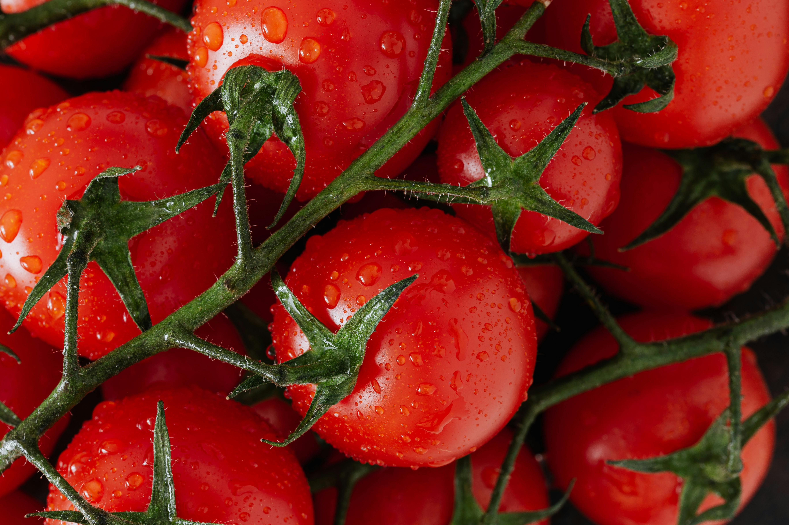
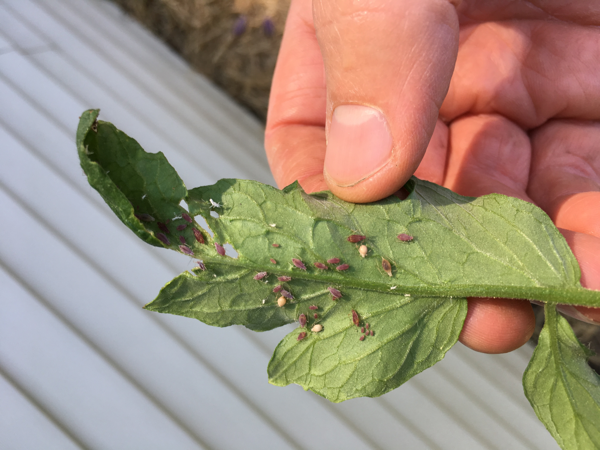

<div align="center">
  
  <h1>Plantify AI</h1>
  <p><strong>Flutter-based plant disease detection app for tomato and rice crops.</strong></p>
  <p>On-device AI diagnosis, treatment guidance, article library, PDF reports, and bilingual support.</p>

  <p>
    
    
    
    
  </p>

  <p>
    
    
    
    
  </p>
</div>

## Overview

Plantify AI is a mobile app built with Flutter to help users identify plant diseases from leaf images. The app runs TensorFlow Lite models directly on-device, then presents a prediction with confidence score, disease explanation, treatment suggestions, and supporting references.

It currently focuses on two crops:

- Tomato
- Rice

## Preview

<p align="center">
  
  
  
</p>

## Features

| Feature | Description |
| --- | --- |
| AI disease detection | Runs local TensorFlow Lite models for image classification |
| Crop-based flow | Lets users choose between tomato and rice before diagnosis |
| Camera and gallery input | Supports direct capture or selecting an existing image |
| Image cropping | Crops leaf photos before inference for better focus |
| Rich result screen | Shows disease label, confidence, symptoms, and treatment guidance |
| Detection history | Saves previous diagnoses locally on the device |
| Article library | Includes educational content related to crops and plant care |
| PDF export | Generates reports that can be shared externally |
| Bilingual support | English and Indonesian language experience |
| Theme support | Includes light and dark themes |

## Tech Stack

<p>
  
  
  
  
  
  
  
</p>

Main packages used in this project:

- `provider`
- `camera`
- `image_picker`
- `image_cropper`
- `image`
- `tflite_flutter`
- `shared_preferences`
- `pdf`
- `share_plus`
- `toastification`

## Detection Pipeline

1. User selects a crop.
2. User captures or imports a leaf image.
3. The image is cropped and preprocessed.
4. A TensorFlow Lite model is loaded from `assets/models/`.
5. The app runs on-device inference.
6. The result screen displays diagnosis details and treatment suggestions.
7. The diagnosis can be saved into history or exported as a PDF report.

## Project Structure

```text
lib/
  main.dart
  models/
  screens/
  services/
  theme/
  widgets/
assets/
  images/
  lottie/
  models/
test/
```

Important modules:

- `lib/screens/` contains the main app flow such as onboarding, dashboard, camera, result, history, library, and settings
- `lib/services/tflite_service.dart` handles model loading and image classification
- `lib/services/detection_history_service.dart` manages saved diagnosis history
- `lib/services/pdf_service.dart` generates PDF reports
- `lib/services/language_service.dart` manages English and Indonesian content
- `lib/models/detection_result.dart` stores disease metadata, recommendations, and references

## Getting Started

### Prerequisites

Make sure the following tools are available:

- Flutter SDK
- Dart SDK
- Android Studio or VS Code
- Emulator or physical device for testing

Check your environment:

```bash
flutter doctor
```

### Installation

```bash
git clone https://github.com/Alifferdiansyah334/PlantifyAI.git
cd PlantifyAI
flutter pub get
```

### Run

```bash
flutter run
```

## Build Commands

```bash
flutter build apk
flutter build appbundle
```

## Testing

```bash
flutter test
```

## Notes

- Model assets are expected under `assets/models/`
- Camera permission is required for live image capture
- Inference runs on-device, so performance depends on the target hardware
- Disease descriptions and article content are currently bundled locally in the app

## Future Improvements

- Add actual app screenshots or device mockups
- Expand support to more crops and disease classes
- Document model training and evaluation results
- Add CI for linting, testing, and release checks
- Improve offline content synchronization

## Contributing

Issues and pull requests are welcome. For larger changes, open an issue first so the implementation direction is clear before work begins.

## License

This repository does not currently include a license file. Add one if you want to define usage and distribution terms explicitly.
